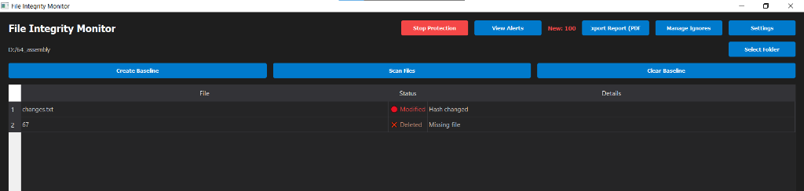

# 🛡️ File Integrity Monitor (Advanced Security Suite)

[](https://www.python.org/downloads/)
[](https://opensource.org/licenses/MIT)
[]()

An advanced, high-performance desktop security utility designed to monitor file system changes in real-time. This suite provides automated protection, historical snapshots (Back-in-time restoration), and professional auditing reports with full Arabic language support.

---

## ✨ Key Features

*   **⚡ High-Performance Multi-threaded Scanning**: Utilizes asynchronous I/O and thread pooling for rapid directory hashing (SSD optimized).
*   **👁️ Real-Time Intelligence**: Event-driven monitoring (via `watchdog`) that detects modifications, additions, or deletions the millisecond they occur.
*   **⏪ Back-in-Time Restoration**: Automatically captures file snapshots upon baseline creation, allowing you to restore any corrupted or deleted file to its original state.
*   **📊 Executive PDF Reporting**: Professional audit logs featuring:
    *   Executive summary dashboards.
    *   Interactive Pie charts for change distribution.
    *   Full support for **Arabic/Mixed-language** paths (Word wrap & RTL rendering).
*   **🛠️ Interactive Alert Management**: A dedicated management console to 'Allow' legitimate changes or 'Undo' suspicious ones.
*   **🛡️ Stealth Background Operation**: Minimized to System Tray with native Windows notifications for non-intrusive security.
*   **⚙️ Zero-Config Persistence**: Built-in SQLite database for tracking history, settings, and complex exclusion rules (Ignore lists).

---

## 📸 Application Showcases

### 🏠 Main Dashboard


### 🔍 Integrity Scan Results


### 🛠️ Interactive Alerts Management


### 📊 Executive PDF Reports (with Arabic Support)


---

## 🚀 Installation & Setup

### Prerequisites
*   Python 3.8 or higher.
*   Pip (Python package manager).

### 1. Clone & Environment Setup
```bash
git clone https://github.com/Eng-sadiq-CYS-su/File_Integrity_Monitor.git
cd File_Integrity_Monitor
python -m venv .venv
source .venv/bin/activate  
```

### 2. Install Dependencies
```bash
pip install -r requirements.txt
```

### 3. Run Application
```bash
python app.py
```

---

## 🛠️ Technology Stack

*   **Engine**: Python 3
*   **GUI**: PyQt5 (Professional Dark Theme)
*   **Storage**: SQLite3 (Transactional Integrity)
*   **I/O Monitoring**: Python Watchdog API
*   **Reporting**: ReportLab (High-fidelity PDF generation)
*   **Internationalization**: Arabic Reshaper & Python-Bidi

---

## 📄 License

Distributed under the **MIT License**. See `LICENSE` for more information.

## 👤 Developer

**صادق الموبدي (Sadiq Al-Mubdi)**
*   [GitHub Profile](https://github.com/Eng-sadiq-CYS-su)

Copyright © 2025. Developed with sadiq for global security.
