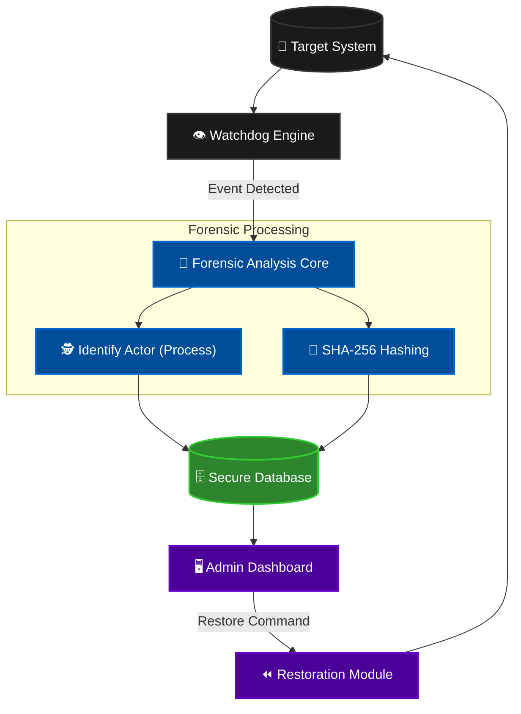

# 🛡️ File Integrity Monitor (FIM)
## منصة التحقيق الجنائي الرقمي المتقدمة | Advanced Digital Forensics Platform

<div align="center">
  

  <br><br>
  
  [](https://www.python.org/)
  [](https://www.microsoft.com/windows)
  [](LICENSE)
</div>

---

## 🌟 نظرة عامة | Overview

**File Integrity Monitor** هو نظام أمني متطور مصمم خصيصاً لفرق الأمن السيبراني والتحقيق الجنائي الرقمي. يقوم النظام بمراقبة ملفات النظام الحساسة في الوقت الفعلي، واكتشاف أي تعديلات غير مصرح بها بدقة متناهية، مع تحديد "المتسبب" (Actor) واستعادة الملفات المتضررة فوراً.

> **Advanced Real-time Integrity Monitoring System with Forensic Capabilities.**

[📘 **دليل المستخدم وتشغيل النظام | User Manual & Training Guide**](USER_MANUAL.md)

---

## 📸 جولة في النظام | Visual Tour

### 🖥️ لوحة القيادة الرئيسية (Main Dashboard)
واجهة تحكم مركزية تعرض حالة المراقبة الحية، مع رسوم بيانية تفاعلية لتوزيع الملفات وحالة النظام.
<div align="center">

</div>

<br>

### 🚨 مركز إدارة التنبيهات (Alerts Management)
سجل دقيق لكل عملية (تعديل، حذف، إنشاء) مع تحديد هوية البرنامج المسؤول (Process Name/ID) والمسار الكامل.
<div align="center">

</div>

<br>

### 📄 التقارير الجنائية (Forensic Reports)
توليد تقارير PDF احترافية ثنائية اللغة (عربي/إنجليزي) تتضمن تحليلاً شاملاً للأحداث، جاهزة للتقديم للجهات الرقابية.
<div align="center">

  <br>


</div>

---

## 🚀 الميزات الأساسية | Key Features

| الميزة (Feature) | الوصف (Description) |
| :--- | :--- |
| **🔍 Real-time Monitoring** | مراقبة فورية باستخدام خوارزميات `Watchdog` المتطورة لاكتشاف التغييرات في أجزاء من الثانية. |
| **🕵️ Forensic Actor** | ميزة فريدة لتحديد **البرنامج** أو **المستخدم** الذي قام بالتعديل (Process Tracking). |
| **🛡️ Ransomware Protection** | حماية ضد برمجيات الفدية عبر اكتشاف التشفير الجماعي السريع للملفات. |
| **⏪ Auto-Restore** | إمكانية "العودة بالزمن" واسترجاع النسخ الأصلية للملفات التي تم العبث بها. |
| **📊 Smart Reporting** | تقارير تحليلية شاملة بصيغة PDF مع رسوم بيانية وتفاصيل دقيقة. |

---

## 🏗️ هيكلية النظام | System Architecture

يوضح المخطط التالي تدفق البيانات من لحظة اكتشاف الحدث وحتى المعالجة والاستعادة:



---

## 🛠️ التثبيت والتشغيل | Installation

### متطلبات التشغيل (Requirements)
- Python 3.9+
- Windows 10/11

### 1. استنساخ المستودع (Clone)
```bash
git clone https://github.com/Eng-sadiq-CYS-su/File_Integrity_Monitor.git
cd File_Integrity_Monitor
```

### 2. إعداد البيئة الافتراضية (Setup)
```bash
python -m venv .venv
.venv\Scripts\activate
pip install -r requirements.txt
```

### 3. تشغيل النظام (Run)
```bash
python app.py
```

---

## 👤 عن المطور | About Developer

**م. صادق الموبدي (Eng. Sadiq Al-Mubdi)**
> *Cybersecurity Engineer & Systems Architect*

متخصص في بناء الأنظمة الأمنية الدفاعية وتطوير أدوات التحقيق الرقمي.

<div align="center">
  <a href="https://github.com/Eng-sadiq-CYS-su">
    
  </a>
  <a href="https://www.linkedin.com/in/sadiq-al-mubdi-3b8389387/">
    
  </a>
</div>

---

<p align="center">
  Made with Eng Sadiq 💖🧠 for a Safer Digital World.
</p>
