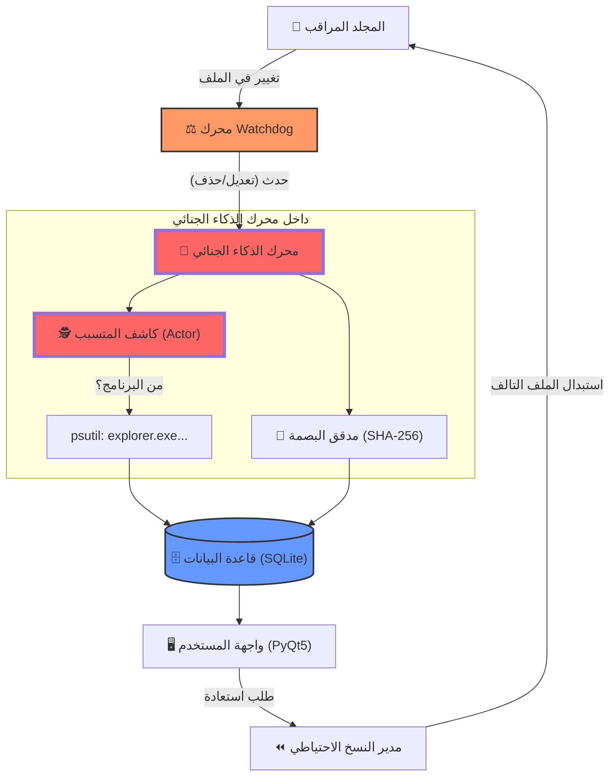
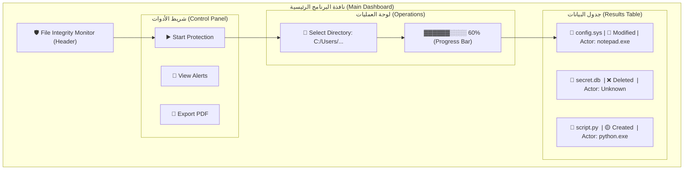

# 🛡️ File Integrity Monitor: منصة التحقيق الجنائي الرقمي المتقدمة

<p align="center">
  
</p>

> **نظام متطور لمراقبة سلامة الملفات والاستجابة الفورية للتهديدات برؤية أمنية عميقة.**

[](https://www.python.org/)
[](https://www.riverbankcomputing.com/software/pyqt/)
[](https://opensource.org/licenses/MIT)
[]()

---

## 🌟 الرؤية الأمنية

في عصر التهديدات الرقمية المعقدة، لم تعد مراقبة النظام مجرد خيار، بل ضرورة قصوى. **File Integrity Monitor** هو أداة جنائية احترافية مصممة لاكتشاف وتتبع وعكس التغييرات غير المصرح بها في نظام الملفات بدقة تصل إلى أجزاء من الثانية.

### 🛡️ الركائز الأساسية
- **النزاهة المطلقة**: مدعومة بخوارزميات SHA-256 عالية الأداء ومتعددة المسارات.
- **التحقيق الجنائي (Forensics)**: ميزة اكتشاف "المتسبب" (Actor) لتحديد البرنامج المسؤول عن كل تعديل بدقة.
- **المرونة والاستعادة**: محرك "العودة بالزمن" المتكامل لاستعادة البيانات فوراً وضمان عدم فقدانها.
- **التقارير التنفيذية**: تقارير PDF ثنائية اللغة (عربي/إنجليزي) مع رسوم بيانية تفاعلية لتحليل البيانات.

---

## 🏗️ التصميم المنطقي للنظام (System Logic Drawing)

بطلب من المستخدم، إليك "رسم" يوضح كيف تتدفق البيانات داخل النظام من لحظة التغيير وحتى إصدار التنبيه:


```mermaid
graph TD
    %% Define Styles
    classDef security fill:#f96,stroke:#333,stroke-width:2px;
    classDef storage fill:#69f,stroke:#333,stroke-width:2px;
    classDef forensic fill:#f66,stroke:#high,stroke-width:4px;

    Folder["📁 المجلد المراقب"] -- "تغيير في الملف" --> Watchdog["⚖️ محرك Watchdog"]
    Watchdog -- "حدث (تعديل/حذف)" --> Intelligence["🧠 محرك الذكاء الجنائي"]
    
    subgraph "داخل محرك الذكاء الجنائي"
        Intelligence --> Actor["🕵️ كاشف المتسبب (Actor)"]
        Intelligence --> Hasher["🔢 مدقق البصمة (SHA-256)"]
        Actor -- "من البرنامج؟" --> Process["psutil: explorer.exe..."]
    end

    Process --> DB[("🗄️ قاعدة البيانات (SQLite)")]
    Hasher --> DB
    
    DB --> UI["🖥️ واجهة المستخدم (PyQt5)"]
    UI -- "طلب استعادة" --> Backup["⏪ مدير النسخ الاحتياطي"]
    Backup -- "استبدال الملف التالف" --> Folder

    class Intelligence,Actor forensic;
    class DB storage;
    class Watchdog security;
```

---

## 🎨 رسم تخطيطي للواجهة (UI Mockup Drawing)

بما أنك طلبت "رسم" التوثيق، إليك تمثيل مرئي لهيكل الواجهة الرئيسية للبرنامج باستخدام الكود:


```mermaid
graph TD
    subgraph "نافذة البرنامج الرئيسية (Main Dashboard)"
        Header["🛡️ File Integrity Monitor (Header)"]
        
        subgraph "شريط الأدوات (Control Panel)"
            Btn1["▶️ Start Protection"]
            Btn2["🔔 View Alerts"]
            Btn3["📄 Export PDF"]
        end

        subgraph "لوحة العمليات (Operations)"
            Folder["📂 Select Directory: C:/Users/..."]
            Progress["▓▓▓▓▓▓░░░░ 60% (Progress Bar)"]
        end

        subgraph "جدول البيانات (Results Table)"
            Row1["📄 config.sys | 🔴 Modified | Actor: notepad.exe"]
            Row2["📄 secret.db  | ❌ Deleted  | Actor: Unknown"]
            Row3["📄 script.py  | 🟡 Created  | Actor: python.exe"]
        end
        
        Header --> Btn1
        Btn1 --> Folder
        Folder --> Progress
        Progress --> Row1
    end
```

---

## 📸 استكشف المنصة (Screenshots)

| الواجهة الرئيسية | تحليل البيانات |
| :---: | :---: |
|  |  |

| إدارة التنبيهات | التقارير الاحترافية (PDF) |
| :---: | :---: |
|  |  |

---

## 🚀 الميزات المتقدمة بالتفصيل

### 🧠 كشف المتسبب (Forensic Actor Discovery)
بخلاف أنظمة المراقبة التقليدية، تقوم هذه المنصة بتحديد **مصدر** التغيير. عبر تتبع مسارات النظام في لحظة التعديل، يتم ربط الحدث بالبرنامج المسؤول (مثل: `explorer.exe` أو أي سكريبت مشبوه).

### ⏪ محرك الاستعادة "العودة بالزمن"
كل فحص للنظام ينشئ "نقطة استعادة" آمنة. في حال تعرض ملف للتلف أو التشفير بواسطة برمجيات الرانسوموير (Ransomware)، يمكن لبروتوكول **Undo Change** استعادته فوراً من مخزن النسخ الاحتياطية المشفر.

### 📊 لوحات تحكم PDF ذكية
توليد تقارير جاهزة للتدقيق الأمني تشمل:
- **رسوم بيانية تفاعلية**: ملخص بصري لحالة النظام الأمنية.
- **دعم اللغة العربية**: تنسيق مثالي للمسارات والنصوص العربية داخل التقارير.

---

## 🛠️ التثبيت والتشغيل الاحترافي

### 1. إعداد البيئة
```bash
git clone https://github.com/Eng-sadiq-CYS-su/File_Integrity_Monitor.git
cd File_Integrity_Monitor
python -m venv .venv
source .venv/bin/activate  # لنظام ويندوز: .venv\Scripts\activate
```

### 2. تثبيت الملحقات
```bash
pip install -r requirements.txt
```

### 3. بناء الملف التنفيذي (Production Build)
لبناء نسخة مستقلة تعمل كبرنامج احترافي على ويندوز:
```bash
pyinstaller --noconsole --onefile --name "FileIntegrityMonitor" --icon "assets/icon.ico" --add-data "assets;assets" app.py
```

---

## 👤 المطور والرؤية التقنية

**صادق الموبدي (Sadiq Al-Mubdi)**
> *مهندس أمن سيبراني ومطور أنظمة متقدمة*

[](https://www.linkedin.com/in/sadiq-al-mubdi-3b8389387/) 
[](https://github.com/Eng-sadiq-CYS-su)

---

## 📄 الرخصة
هذا المشروع مرخص بموجب رخصة MIT - راجع ملف [LICENSE](LICENSE) لمزيد من التفاصيل.

---
<p align="center">
  تم التطوير بكل ❤️ لتعزيز الأمن الرقمي العالمي.
</p>
